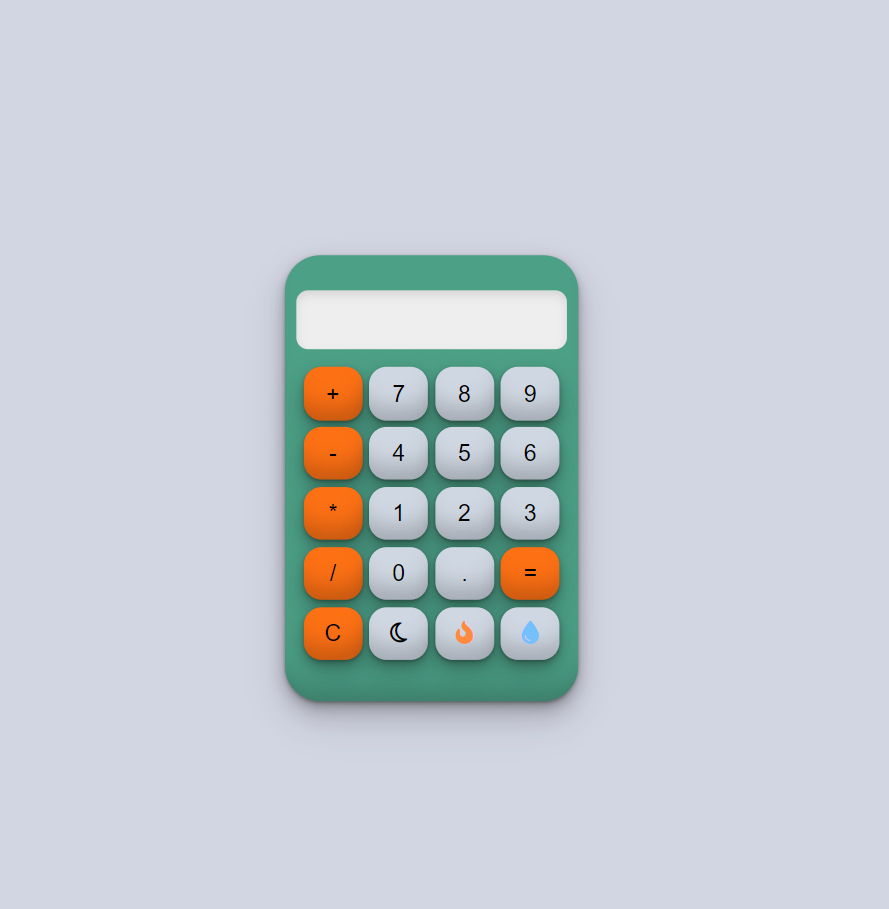
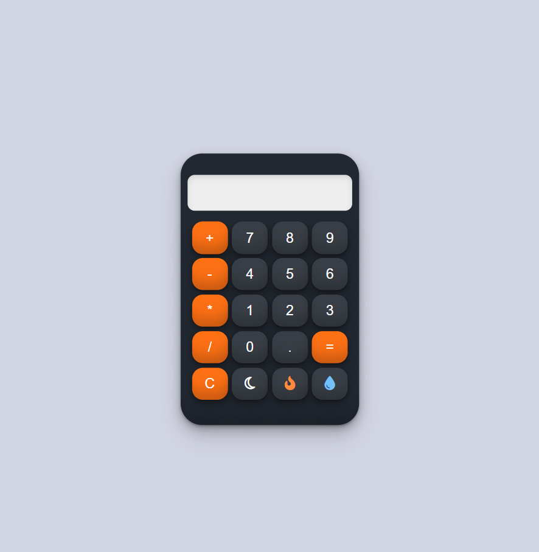
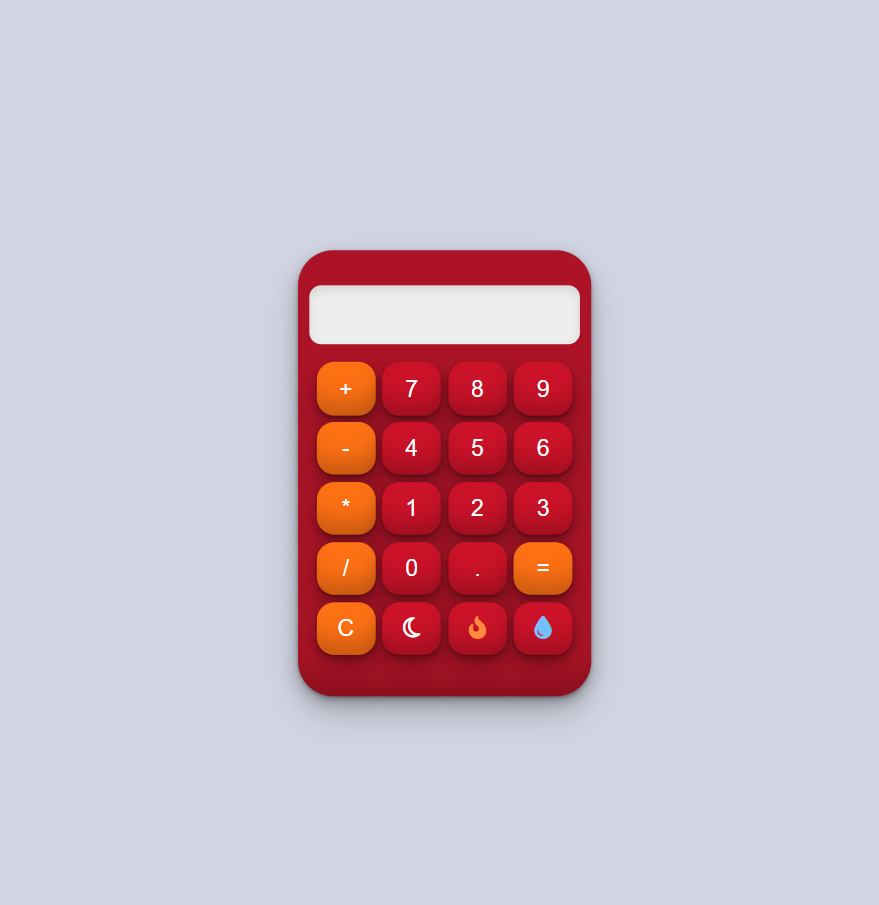
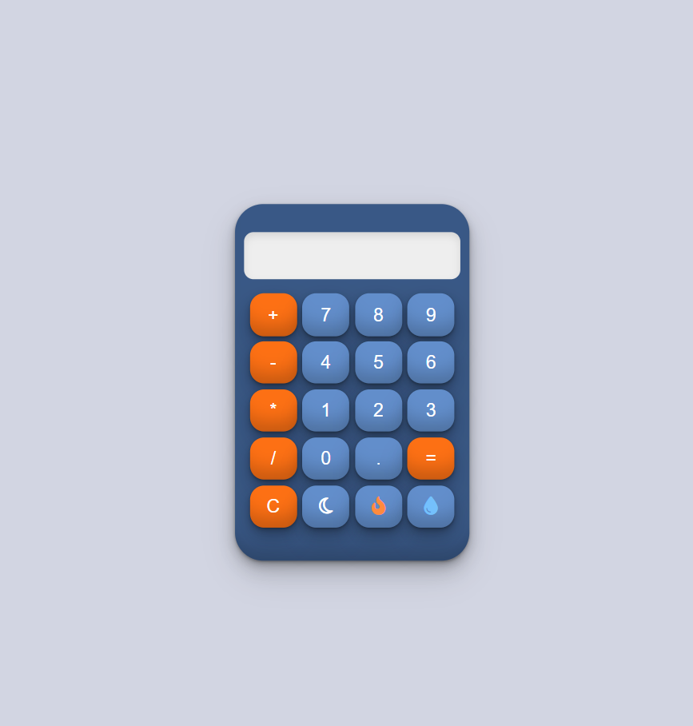

# Calculator

A simple web-based calculator with multiple themes. Built using HTML, CSS, and JavaScript.

## Features

- Basic arithmetic operations: addition, subtraction, multiplication, and division.
- Clear display functionality.
- Themed interfaces: Default, Dark, Fire, and Blue.

## Demo

You can view a live demo of the project [here](https://eidghannam.github.io./calculator/).

## Installation

1. Clone the repository:
    ```bash
    git clone https://github.com/yourusername/calculator.git
    ```
2. Navigate to the project directory:
    ```bash
    cd calculator
    ```
3. Open `index.html` in your preferred web browser.

## Usage

- Click on the buttons to perform operations.
- Use the `C` button to clear the display.
- Click on the theme buttons (moon, fire, water droplet) to switch between themes.

## Code Overview

### HTML

The `index.html` file sets up the basic structure of the calculator, including the display and buttons.

### CSS

The `style.css` file provides styling for the calculator, including themes:
- Default: Light theme
- Dark: Dark theme
- Fire: Red theme
- Blue: Blue theme

### JavaScript

The `index.js` file contains the logic for the calculator:
- `appendToDisplay(input)`: Adds the clicked button's value to the display.
- `clearDisplay()`: Clears the display.
- `calculate()`: Evaluates the expression on the display.
- Theme toggling functionality.

## Screenshots

### Default Theme



### Dark Theme



### Fire Theme



### Blue Theme



## Acknowledgements

- Font Awesome for icons.

